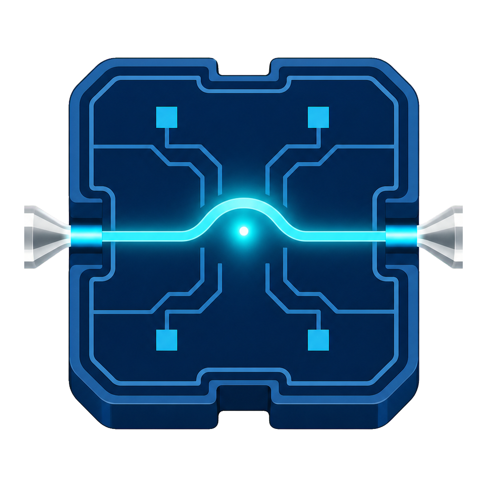

<p align="center">
  
</p>

<h1 align="center">PICBench</h1>

<p align="center">
  Automated fiber alignment and spectral characterization of silicon photonic integrated circuits.
</p>

> [!WARNING]
> PICBench controls real laser emission and motorized fiber stages. Automatic motion must only be enabled after validating stage directions, homing behavior, travel limits, safe Z height, camera calibration and the laboratory's physical safety controls. Software interlocks do not replace supervision or an accessible hardware emergency stop.

## Overview

PICBench brings the complete photonic characterization workflow into one Windows desktop application. It combines:

- non-moving discovery of VISA instruments, Thorlabs controllers and USB cameras;
- persistent, independent connections to each laboratory device;
- manual and automatic control of two XYZ fiber stages;
- camera-guided fiber, chip-surface and grating-coupler calibration;
- safe travel, automatic Z approach and local XY power optimization;
- wavelength sweeps and resumable batch measurements;
- live camera, stage map, spectra and activity dashboards;
- simulation tools for development away from the laboratory computer.

Machine-specific serial numbers, calibration profiles and measurement results remain local and are excluded from Git.

## Supported setup

| Function | Equipment |
|---|---|
| Input/output fiber positioning | Two Thorlabs MAX381/M NanoMax stages |
| Stepper control | Thorlabs BSC203, three channels per stage |
| Tunable laser | Yenista/EXFO OSICS T100 through GPIB-USB |
| Optical power | Thorlabs PM320E |
| Machine vision | Generic USB camera through OpenCV |

Stage A maps `X/Y/Z` to BSC203 channels `1/2/3`. Stage B maps `X/Y/Z` to channels `2/1/3`. Exact serial numbers and VISA resources are discovered and selected on the laboratory computer.

Hardware support depends on the vendor drivers, firmware and APIs installed on the target PC. See [Laboratory installation](docs/LAB_PC_INSTALLATION.md) for the staged setup procedure.

## Windows release

Download `PICBench.exe` and `PICBench.exe.sha256` from the [latest GitHub Release](https://github.com/jorpago2/picbench/releases/latest). The executable is portable and does not require a Python installation.

Verify the download before running it:

```powershell
Get-FileHash .\PICBench.exe -Algorithm SHA256
Get-Content .\PICBench.exe.sha256
```

Thorlabs Kinesis, a compatible VISA runtime and the camera drivers must still be installed separately. Releases are not code-signed yet, so Windows SmartScreen may display a warning.

## Quick start: source

PICBench currently targets Windows x64. From PowerShell in the repository root:

```powershell
py -3.11 -m venv .venv
.\.venv\Scripts\python.exe -m pip install -r requirements-hardware.txt
.\.venv\Scripts\python.exe -m scripts.caracterizacion_fotonica --self-test
.\.venv\Scripts\pythonw.exe -m labauto.ui
```

Run the simulated characterization workflow without connected equipment:

```powershell
.\.venv\Scripts\python.exe -m scripts.caracterizacion_fotonica `
  --simulate `
  --devices .\examples\devices.example.csv
```

## Laboratory setup

Vendor drivers are intentionally not included. After installing Thorlabs Kinesis, the GPIB/VISA stack and the camera driver, discover the available devices without moving any axis:

```powershell
.\.venv\Scripts\python.exe -m labauto.diagnostics `
  --save .\config\hardware.discovered.json

.\.venv\Scripts\python.exe -m scripts.crear_config_real `
  --discovered .\config\hardware.discovered.json `
  --out .\config\hardware.real.json

.\.venv\Scripts\python.exe -m scripts.validar_config `
  --config .\config\hardware.real.json
```

Review every generated value before initialization. Discovery only enumerates resources; it does not home stages, move axes or enable the laser.

## Measurement workflow

The interface follows the physical laboratory sequence:

1. **Setup** - choose the device CSV, result directory and local configuration.
2. **Devices** - discover, select, connect and test each instrument independently.
3. **Calibration** - home the stages, register the reference device, calibrate the camera and map grating pairs.
4. **Live** - position both fibers, approach the chip, optimize coupling and monitor the camera and stage map.
5. **Results** - inspect, compare, zoom and pan measured spectra while a batch is running or after completion.

The device table is a UTF-8 CSV exported from the layout flow. Each row identifies one optical structure, its input/output grating coordinates and its wavelength sweep. The complete contract is documented in [Device CSV format](docs/DEVICE_CSV_FORMAT.md).

## Safety model

PICBench adds software safeguards around the physical setup:

- hardware discovery is non-moving;
- real motion and laser commands require explicit confirmation;
- stage movement is rejected outside configured XYZ limits;
- homing state, controller limits and current positions are checked before motion;
- both fibers move to the configured safe Z height before cross-chip XY travel;
- camera calibration is tied to camera resolution and stage serial numbers;
- automatic Z approach retracts after loss of visual confidence or failed acquisition;
- closed-loop grating positioning stops on excessive correction, worsening error or stale frames;
- emergency stop independently requests stage stop and laser output off.

The first real validation must use low optical power, fibers clear of the chip and direct observation of every commanded movement.

## Configuration and calibration

Public defaults are provided in [examples/hardware.example.json](examples/hardware.example.json). The active files under `config/` and `workspace/state/` are local because they contain machine-specific resources and physical calibration data.

Important settings include:

- stage serial numbers, channel mapping and usable XYZ limits;
- safe Z travel height, velocity and acceleration;
- OSICS mainframe slot, wavelength range and output power;
- PM320E resource and measurement channel;
- camera index, resolution and frame rate;
- pixel-to-stage transforms and fiber-tip templates;
- grating-pair positions and automatic Z approach thresholds;
- XY optimization span, step size and stopping criteria.

Do not copy calibration files between setups without repeating the physical checks.

## Reproducible output

PICBench writes run data under `workspace/results/`. Depending on the workflow, a result contains:

- one `spectrum.csv` per measured spectrum;
- `metadata.json` with device, sweep and acquisition information;
- stage positions and motion records;
- resumable batch state in `batch.json`;
- calibration and reference snapshots under `workspace/state/`;
- optional camera captures used for visual verification.

Measurement data and local state are ignored by Git so the public repository remains free of laboratory identifiers and unpublished results.

## Documentation

- [Laboratory PC installation](docs/LAB_PC_INSTALLATION.md)
- [Device CSV format](docs/DEVICE_CSV_FORMAT.md)
- [Photonic characterization plan](docs/PHOTONIC_CHARACTERIZATION_PLAN.md)

## Validation

Run the built-in checks before packaging or connecting hardware:

```powershell
.\.venv\Scripts\python.exe -m labauto.ui --self-check
.\.venv\Scripts\python.exe -m scripts.caracterizacion_fotonica --self-test
.\.venv\Scripts\python.exe -m scripts.caracterizacion_fotonica `
  --validate-devices .\examples\devices.example.csv
```

Passing a software check or importing a vendor library does not prove real instrument compatibility. Hardware acceptance must verify identification, safe states, motion direction, displacement, limits and measured optical response on the target PC.

## Repository layout

```text
labauto/                    Application, workflows and hardware adapters
scripts/                    Command-line tools and hardware checks
assets/                     PICBench application icon
config/                     Local hardware discovery and configuration
workspace/                  Local state, captures and measurement results
examples/                   Public device and hardware examples
docs/                       Installation, CSV contract and project notes
.github/workflows/          Automated Windows release build
PICBench.bat                Windows source launcher
requirements-hardware.txt   Python hardware-access dependencies
requirements-build.txt      Windows executable build dependencies
```

## Building a Windows release

Build and verify the executable locally:

```powershell
.\scripts\build_windows.ps1
```

The output is written to `release/PICBench.exe` with its SHA-256 checksum. Pushing a `v*` tag runs the same checks and publishes both files through GitHub Actions.

## Project status

The desktop interface, simulation workflow, device discovery, manual stage control, calibration tools, guarded positioning, spectral acquisition and resumable batches are implemented. Final end-to-end acceptance remains specific to the complete laboratory setup and must be repeated after changes to mechanics, optics, drivers, firmware or calibration.

## Contributing

Bug reports and pull requests should include:

- simulation or hardware mode;
- equipment model, connection type and driver version;
- sanitized configuration fields;
- exact error message and reproduction steps;
- confirmation that no unsafe motion or optical output was attempted.

Never publish hardware serial numbers, local paths, calibration files or experimental results without permission.

## License

PICBench is released under the [MIT License](LICENSE).

Developed by Jorge Parra Gomez at the University of Valencia.
